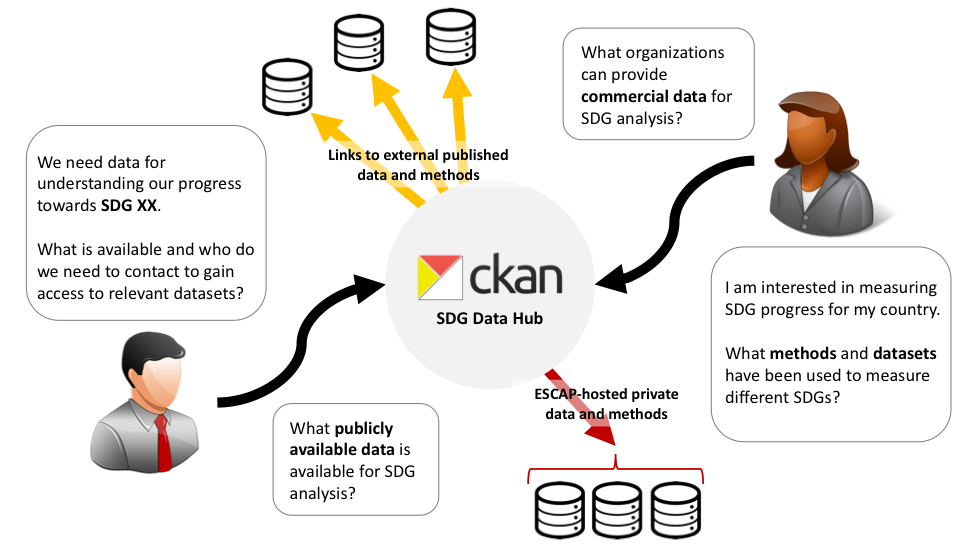

# SDG Data Hub

Version: 1.0 beta

## Author

[David Johnson](http://djson.io), *Big Data Consultant*, for [UNESCAP](http://www.unescap.org).

## Overview

The SDG Data Hub is a platform to expand and scale up the use of innovative data approaches in ESCAP member states as they close data gaps to monitor the SDGs. While there are ongoing efforts to build capacity in big data for SDGs in the UN through training (e.g. The UNECE Sandbox big data platform) and global inventories of standards (e.g. UN Stats Global inventory of Statistical Standards) and big data projects (UN Big Data Inventory), there has yet to be a single platform to bring together both information about different data, and how it has been applied to SDG research and development.  The Data Hub will bring together key indicator research projects, enable reproducible research and the sharing of methodology, consolidate training methodologies through interactive tutorials, and provide a hub for governments, industry, research and the development communities broadly to explore and adopt open source innovations. The Data Hub will connect researchers authoring peer-reviewed, innovative data science methods with opportunities to pilot and scale up the use of these for compiling and analysing SDG indicators. 

The SDG Data Hub is built from a customized implementation of CKAN, the open source data platform in use by government and organizations around the world. 

## Installation on Amazon EC2

Launch an Amazon EC2 instance using Amazon Linux AMI 2017.09.1 (HVM), SSD Volume Type (tested against `ami-1a962263`), `t2.medium` instance type, and use the following in the Instance Details Advanved Details "User data" section:

    #!/bin/sh
    export PATH=/usr/local/bin:$PATH;

    yum update
    yum install docker -y
    service docker start
    mv /root/.dockercfg /home/ec2-user/.dockercfg
    chown ec2-user:ec2-user /home/ec2-user/.dockercfg
    usermod -a -G docker ec2-user
    curl -L https://github.com/docker/compose/releases/download/1.17.1/docker-compose-`uname -s`-`uname -m` > /usr/local/bin/docker-compose
    chmod +x /usr/local/bin/docker-compose
    chown root:docker /usr/local/bin/docker-compose

    yum install git -y
    git clone https://github.com/cslovell/sdgdatahub-runtime /home/ec2-user/sdgdatahub-runtime
    /usr/local/bin/docker-compose -f /home/ec2-user/sdgdatahub-runtime/docker-compose.yml up -d
    
100GiB of EBS is recommended and take care to ensure your Security Group has exposed ports 80 and 443 (HTTP/HTTPS).
